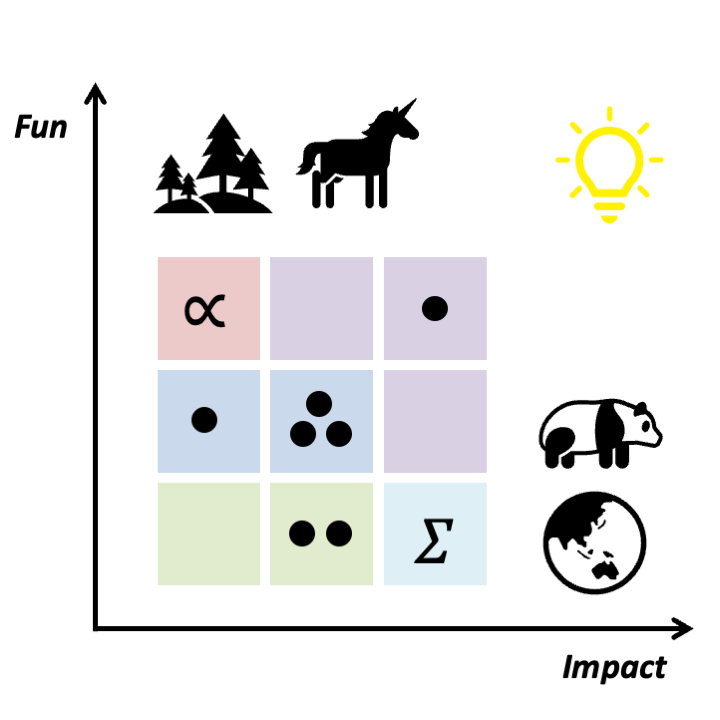

---

## Muyang Lu(Lyu) 吕牧羊, Assistant Professor

<!-- Side-by-side image + text (image left) -->

  <!-- Profile Picture (left column) -->
  

    
  

  <!-- Bio Text (right column) -->
  

    Muyang’s research focuses on developing theoretical and statistical tools for macroecological studies. His work centers on niche and species distribution modeling, metacommunity dynamics, and the impacts of climate change on biodiversity.
  

