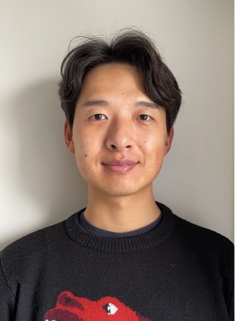

---

## Muyang Lu(Lyu) 吕牧羊, Assistant Professor

<!-- Side-by-side image + bio layout -->

  <!-- Profile Picture -->
  
 <!-- Fixed width for image column -->
    
  

  <!-- Bio Text -->
  
 <!-- Flexible width for text (shrinks on mobile) -->
    Muyang’s research focuses on developing theoretical and statistical tools for macroecological studies. His work centers on niche and species distribution modeling, metacommunity dynamics, and the impacts of climate change on biodiversity.
  

