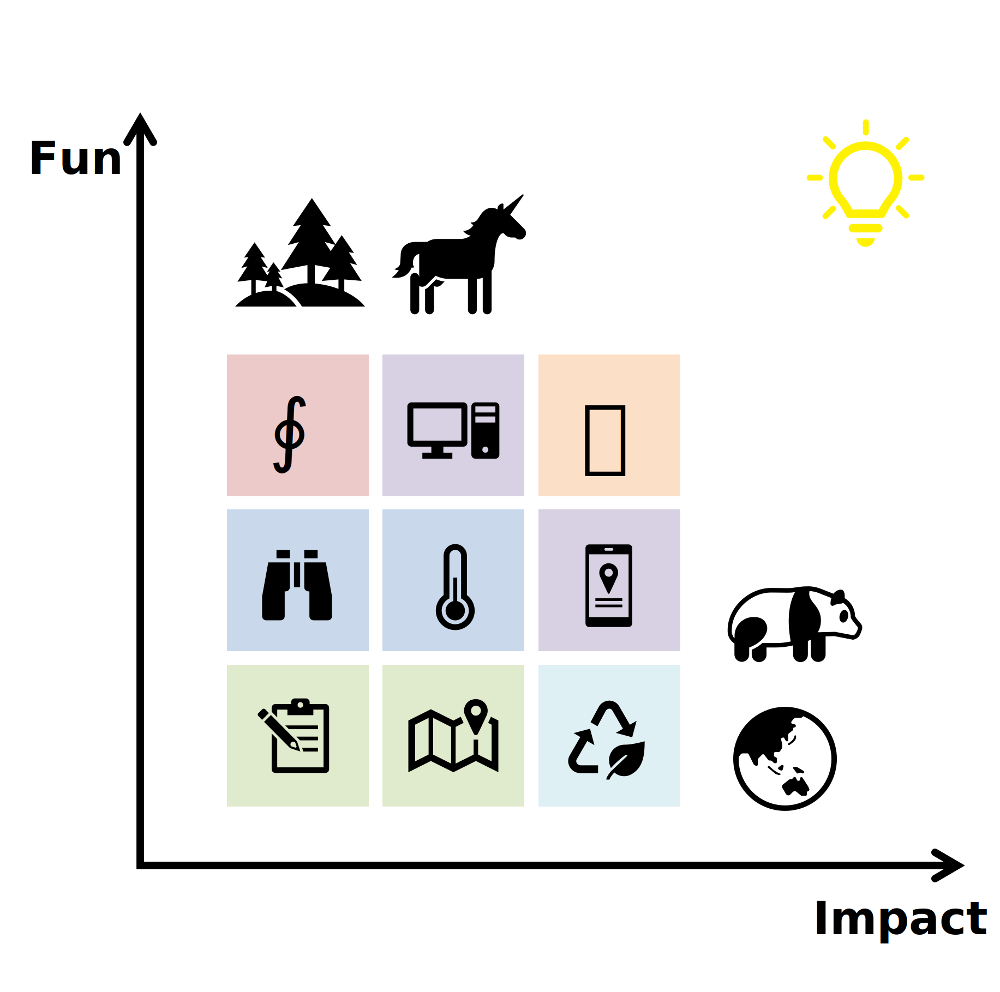

<!-- No titles/headings at all -->

<!-- Add Dark/Light Mode Styling for the Title + KaiTi for Chinese Text -->

  <!-- Styled title (dark mode compatible) -->
  <h1 class="studio-title">
    Integrative Macroecology
  </h1>
  
  <!-- Abstract spatial ecology banner (main visual focus) -->
  

  <!-- Bio text (plain paragraph, no headings) -->
  

    My name is Muyang Lu (吕牧羊). I am a theoretical ecologist based at Sichuan University, Chengdu, China (a city most famous for giant pandas and spicy hotpot). 
    I use mathematical and statistical tools to understand and predict macroecological patterns across scales.
  

