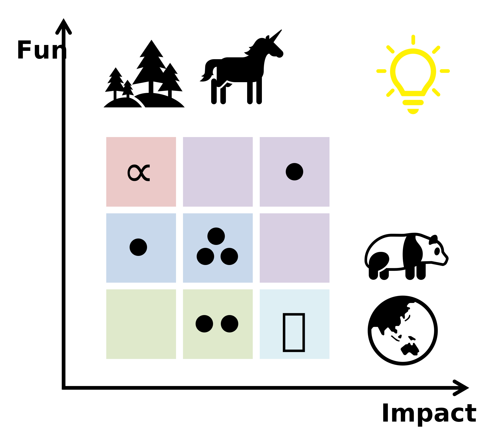

<!-- No titles/headings at all -->

  <!-- Styled title (matches abstract banner vibe) -->
  <h1 style="font-family: sans-serif; font-style: italic; font-size: 1.8rem; color: #2c3e50; font-weight: 500; margin-bottom: 1.5rem;">
    Integrative Spatial Ecology Studio
  </h1>
  
   <!-- Abstract spatial ecology banner (main visual focus) -->
  

  <!-- Bio text (plain paragraph, no headings) -->
  

    Our group (of which I am the only member so far 😝) is now based at Sichuan University, Chengdu, China.  
    We integrate theoretical, statistical, and empirical tools to understand and predict how biodiversity changes across scales.

  

